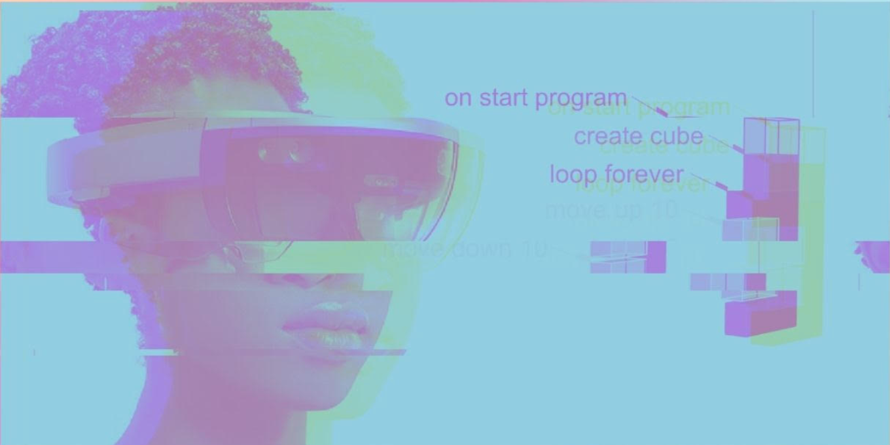

# Description

The increasing sophistication and availability of Augmented and Virtual Reality
(AR/VR) technologies wield the potential to transform how we teach and learn computational
concepts and coding. This project develops a platform for creative coding in virtual
and augmented reality. The Embodied Coding Environment (ECE) is a node-based system developed in the
Unity game engine. It is conceptualized as a merged digital/physical workspace where spatial
representations of code, the visual outputs of the code, and user editing histories are
co-located in a virtual 3D space.

It has been theorized that learners’ abilities to understand and reason about functions,
algorithms, conditionals, and other abstract computational concepts stem in part from more
fundamental sensori-motor and perceptual experiences of the physical world. Our own work, for
instance, has revealed that computer science (CS) educators incorporate a wide range of
metaphors grounded in tangible experience into their lessons on computational concepts, such as
demonstrating sorting algorithms with a deck of cards or the transfer of information between
functions by throwing paper airplanes. Our long-term research aims center on the question of
how a coding platform that supports these types of embodied conceptual phenomena can make
learning to code become a more intuitive process.

# Video

<iframe width="560" height="315" src="https://www.youtube.com/embed/oZYu1BHwKpI" title="YouTube video player" frameborder="0" allow="accelerometer; autoplay; clipboard-write; encrypted-media; gyroscope; picture-in-picture" allowfullscreen></iframe>

Demonstration from the [SD CSTA](https://csta.ucsd.edu/) Happy Hour, November 18, 2021, featuring Timothy Wood.

<iframe width="560" height="315" src="https://www.youtube.com/embed/-QucxZofqvs" title="YouTube video player" frameborder="0" allow="accelerometer; autoplay; clipboard-write; encrypted-media; gyroscope; picture-in-picture" allowfullscreen></iframe>

Demonstration of the Whiteboard and Gestural interface from the UCSD Design Innovation Building dedication November 18, 2021, featuring Tommy Sharkey.

<!-- 

  <iframe width="560" height="315" src="https://www.youtube.com/embed/2Dbk7BSQOII?t=2176" title="YouTube video player" frameborder="0" allow="accelerometer; autoplay; clipboard-write; encrypted-media; gyroscope; picture-in-picture" allowfullscreen></iframe>

 -->
 
# Tools

[Coming Soon]

# Workshops, Presentations, Papers
- Workshop: [_Exploring Virtual Reality and Embodied Computational Reasoning_](icer/README.md) ICER 2021, Saturday August 14, 2021
- Video: [_Embodied Coding in Augmented Reality_](https://videohall.com/p/2000), 2021 NSF STEM for All Video Showcase
- Poster: 13th International Conference on Computer Supported Education, ACM CSEDU 2021, 23-25 April, 2021
- Study: [_Spring Break Research Experience_](sbre/README.md), UC San Diego, March 2021

# Team
- Ying Wu, PI [insight.ucsd.edu](https://insight.ucsd.edu)
- Robert Twomey, co-PI [roberttwomey.com](https://roberttwomey.com)
- Monica Sweet, Investigator [UCSD CREATE](https://create.ucsd.edu/about/people/index.html#Research-&-Evaluation)
- Timothy Wood, Postdoc [fishuyo.com](http://fishuyo.com/)
- Tommy Sharkey, Grad Researcher [tlsharkey.com](https://www.tlsharkey.com/)
- Amy Eguchi, Investigator [UCSD EDS](https://eds.ucsd.edu/discover/people/faculty/eguchi.html)

# Contact
To learn more, contact PI Ying Wu at [ycwu@ucsd.edu](mailto:ycwu@ucsd.edu)

# Participating Labs

- [insight.ucsd.edu](https://insight.ucsd.edu)
- [imagination.ucsd.edu](http://imagination.ucsd.edu)
- [ubicomp.ucsd.edu](http://ubicomp.ucsd.edu/)
- [cohab-lab.net](http://cohab-lab.net)

# Support

This work is supported by the National Science Foundation under [Grant #2017042](https://nsf.gov/awardsearch/showAward?AWD_ID=2017042)
