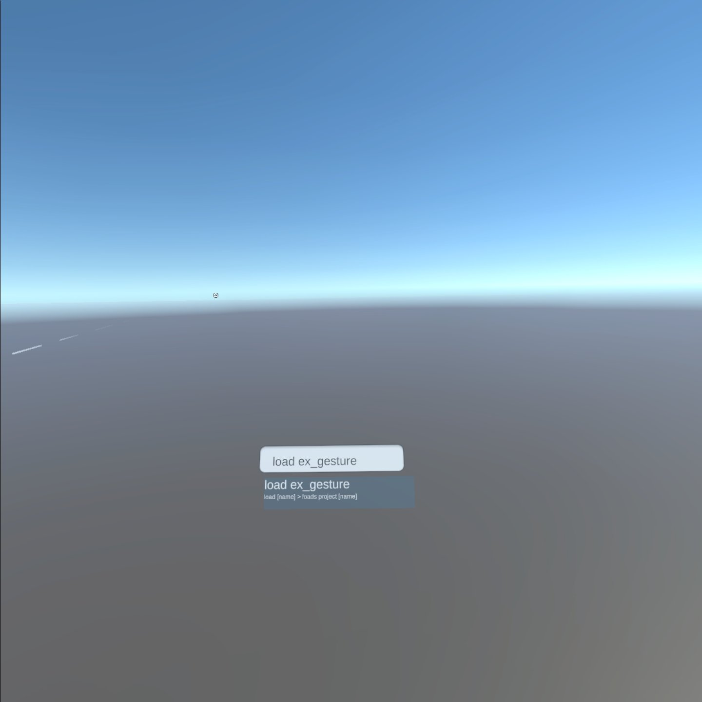
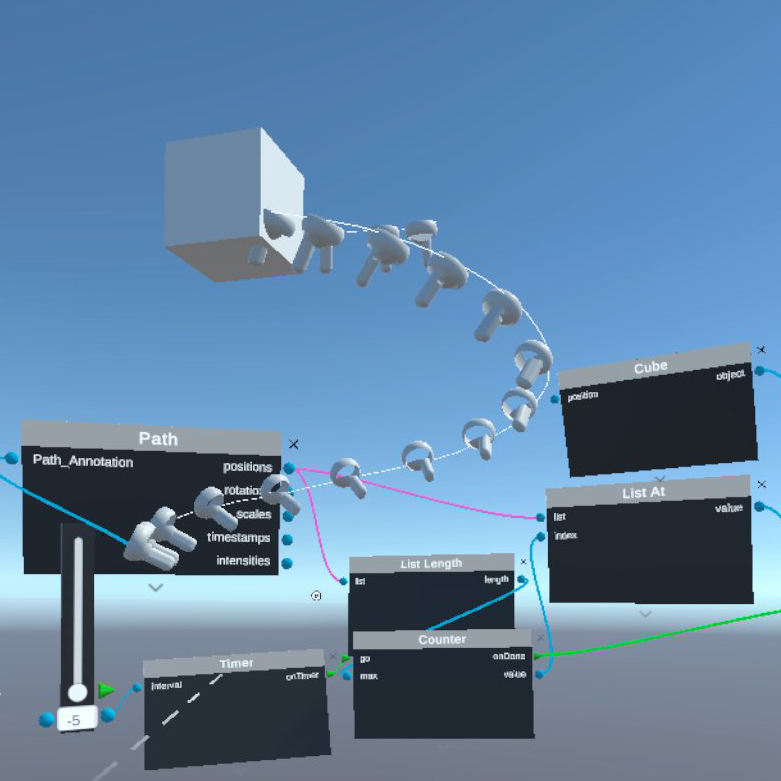
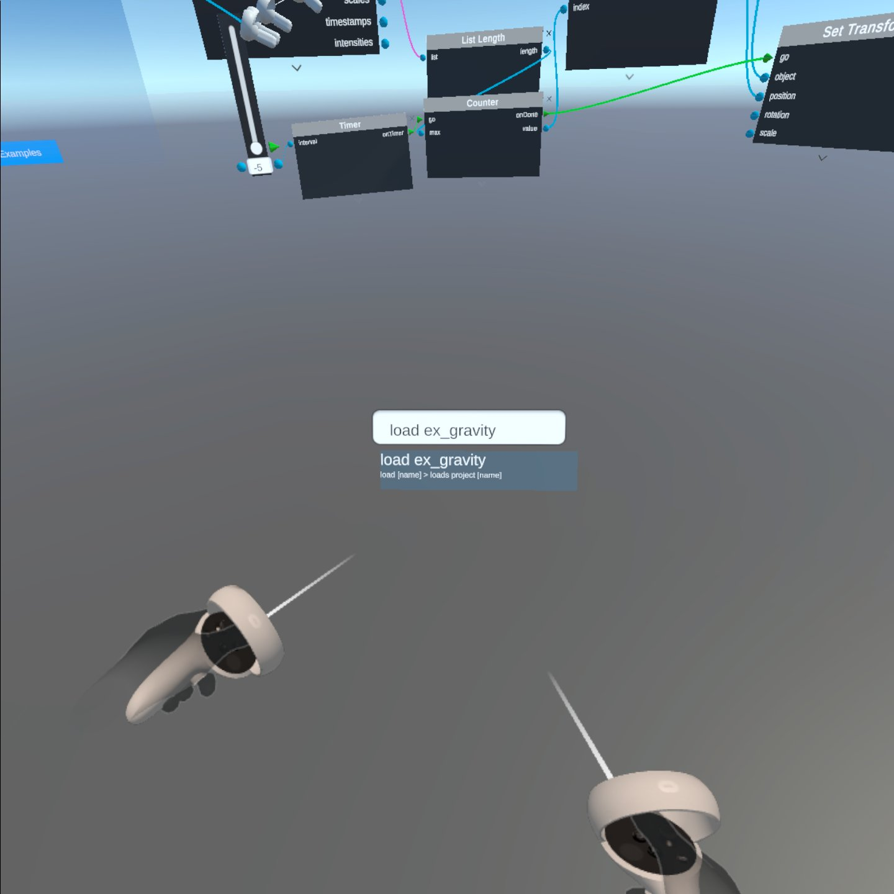
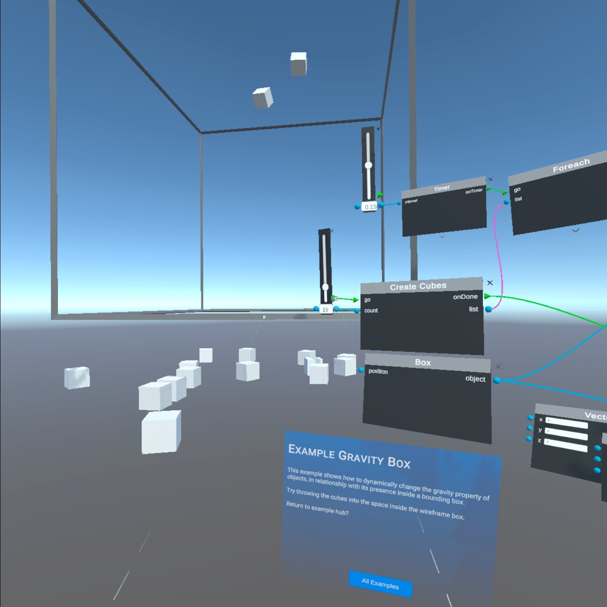
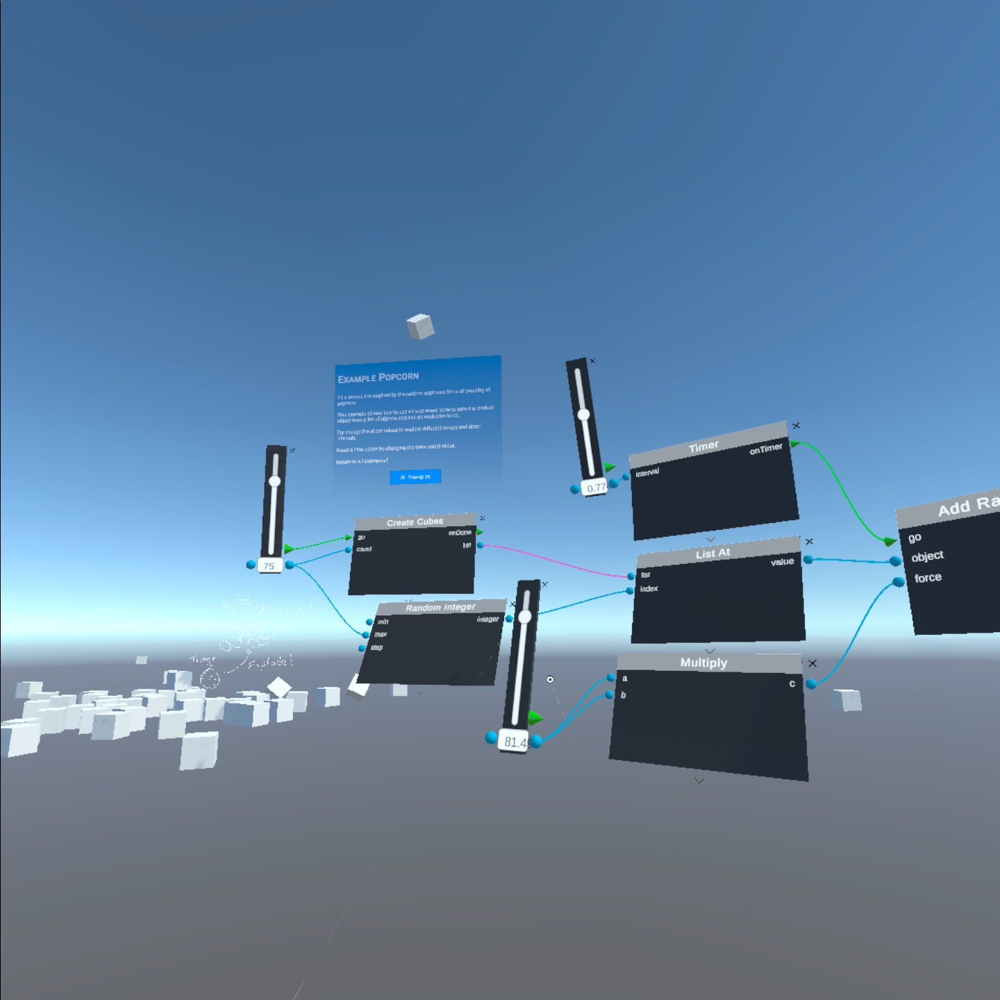
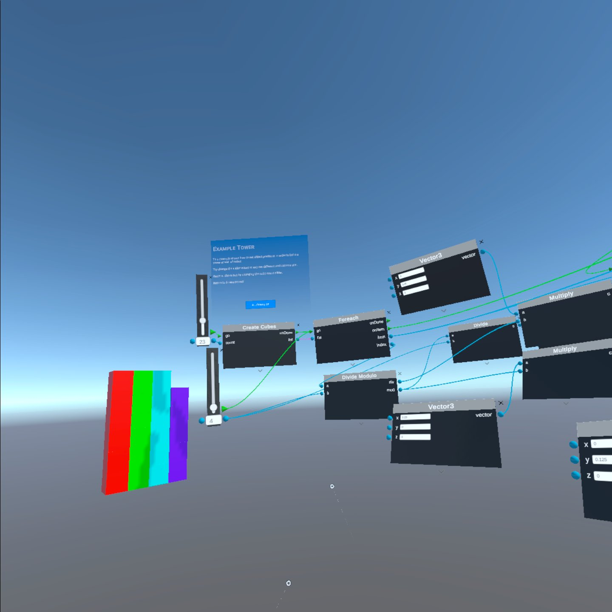
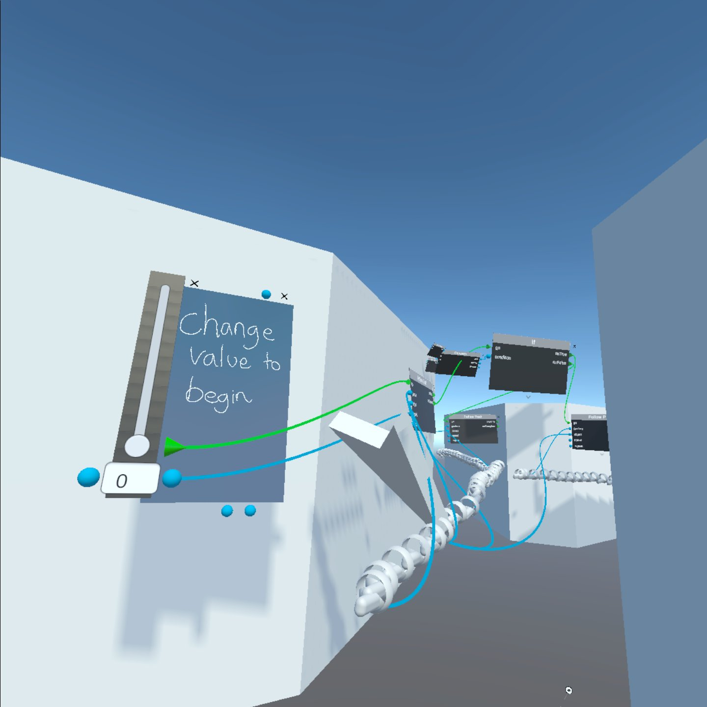
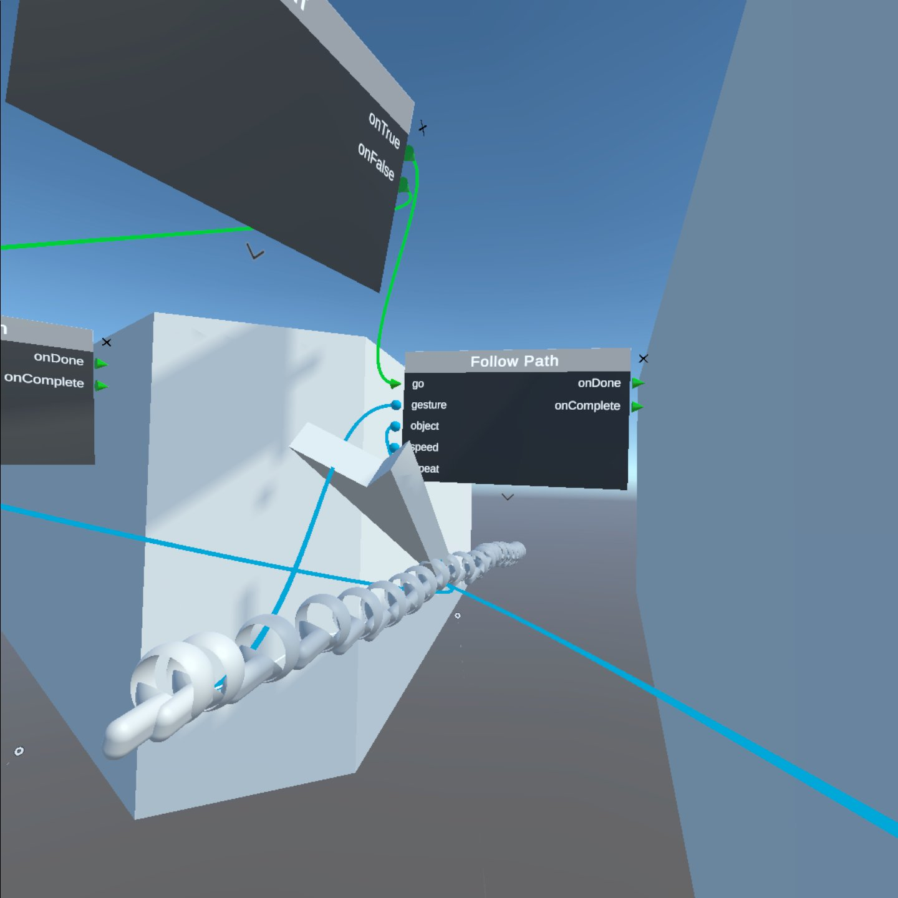

# Embodied Code Documentation

[Getting started with Embodied Code on the Quest 2 headset](./getting-started.md) - installing app on headset and running first tutorial

# Example Scenes

## Gesture

Demonstrates creating a gesture in space, and using that as a signal to drive the motion of a game object.

 

To load the scene: `load ex_gesture`

## Gravity

Game objects move upwards (low gravity) until they encounter a height threshold, and when they fall with high gravity.

 

To load the scene: `load ex_gravity`

## Gravity Box

Define lower gravity within a box. When objects hit the bounds of the box, normal gravity is restored.

To load the scene: `load ex_gravbox`

## Popcorn

Create a pile of game objects. Set a timer which periodically launches one of those objects with a random upwards velocity. ("pop!")

To load the scene: `load ex_popcorn`

## Tower of Cubes

Use sliders to create a wall of cubes (_n_ cubes, in _m_ columns). Random forces ("wind") or user ineraction cause the objects to topple.

To load the scene: `load ex_tower`

## Drone

Inside of a 3d modeled corridor, gestures define two possible paths for a drone. Send the drone to navigate the hallway.

 

To load the scene: `load ex_drone`

# Coding Challenges
- [coming soon]
