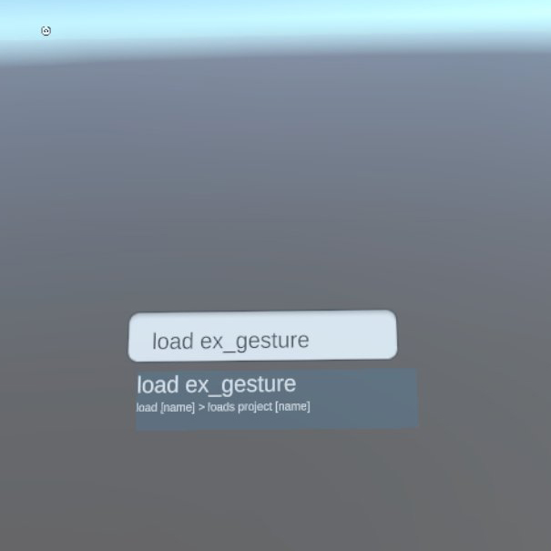

# Embodied Code Documentation

[Getting started with Embodied Code on the Quest 2 headset](./getting-started.md) - installing app on headset and running first tutorial

# Example Scenes

## Gesture

Demonstrates creating a gesture in space, and using that as a signal to drive the motion of a game object.

 

To load the scene: `load ex_gesture`

## Gravity

 

To load the scene: `load ex_gravity`

## Gravity Box
`load ex_gravbox`

## Popcorn
`load ex_popcorn`

## Tower of Cubes
`load ex_tower`

## Drone
`load ex_drone`

# Coding Challenges
- [coming soon]
