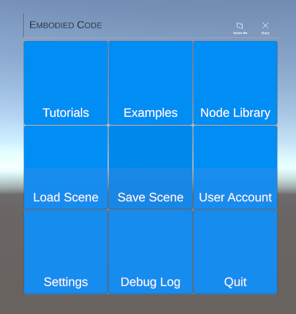
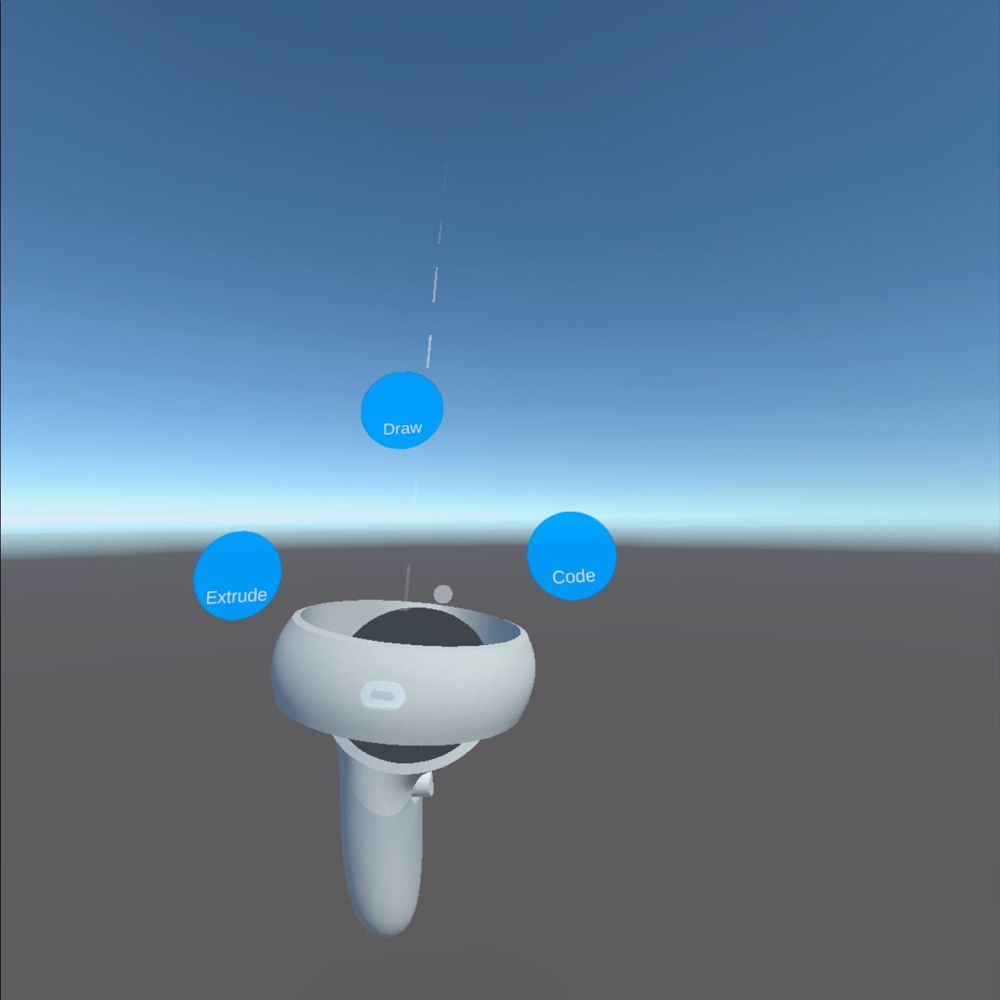

[Overview](README.md) | [Documentation](documentation.md) | [Web Editor](http://app.embodiedcode.net/users/login)

# Tools
This page takes you through all of the tools within the Embodied Code Environment. This includes the [Main Menu](#Main-Menu) and the [Toolbox](#Toolbox)

# Main Menu

[Learn more about the main menu here.](docs/UI-MainMenu.md)

# Toolbox

In each of the different modes in the toolbox, the controller buttons have different functions. Press B on the right controller, or Y on the left controller to bring up the toolbox. You have the option to code, draw, or extrude.

## Code Mode
Code Mode is the most used mode in Embodied Code, so it is important to know how to use it. 

### Selection and Control

Point your controller at any object, button, node, or drawing. Then, press the Left or Right Touch Trigger.

Use one selection tentacle (L/R Touch Trigger) for position/rotation.

Use both selection tentacles (Both Touch Triggers) for position/size/rotation.

### Search

Press the "A" button on the Right Oculus controller.

A search bar will appear. Now, you can enter keywords, such as save, load, clear, etc., or search for nodes to add to your scene.

To get rid of the search bar, press "B" on the Right Oculus controller.

## Draw Mode
### Creating and Erasing Drawings

After selecting draw mode in the tool box, use the "A" button on your right controller or the "X" button on the left controller to draw.

Use the "B" button on your right controller or the "Y" button on the left controller to erase your drawings.

Use drawing as a way to annotate code or draw out ideas. 

Happy drawing!

## Extrude Mode
Coming soon...

