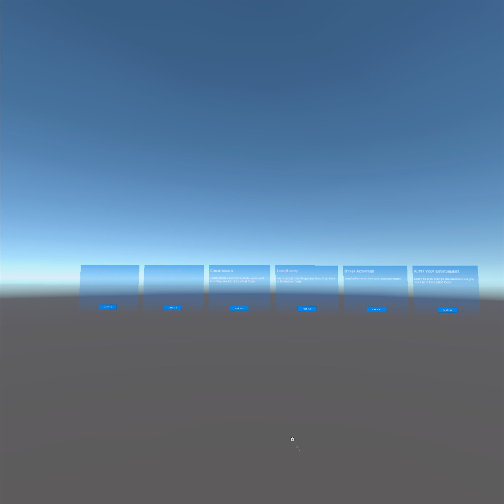
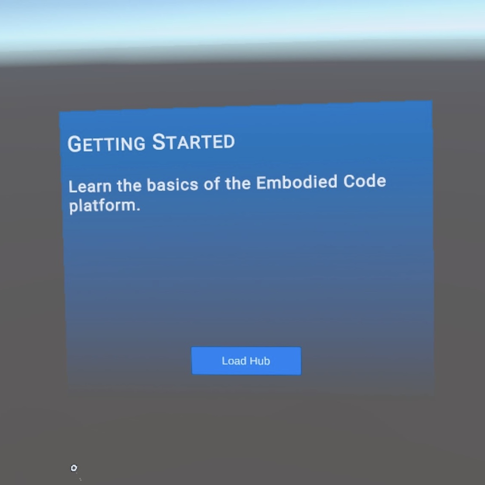
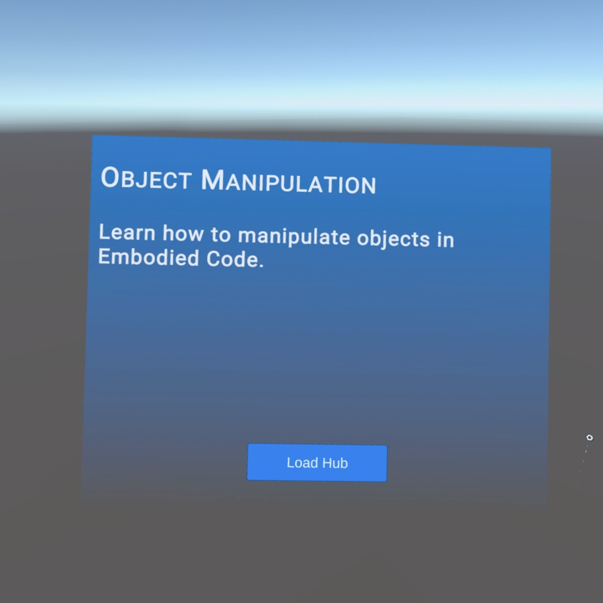
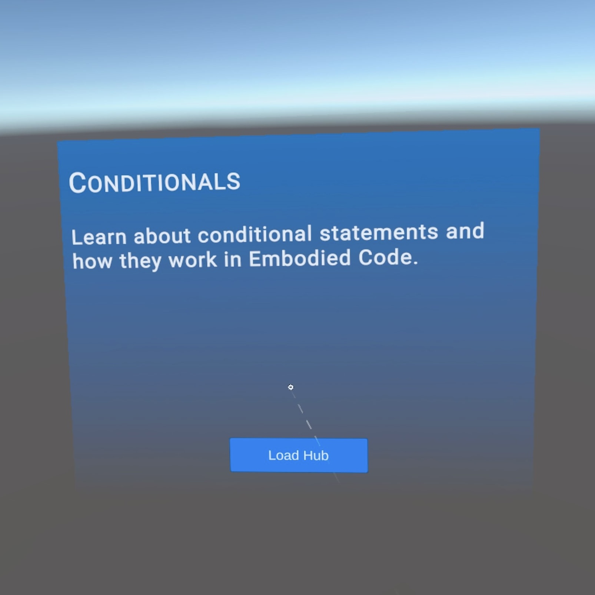
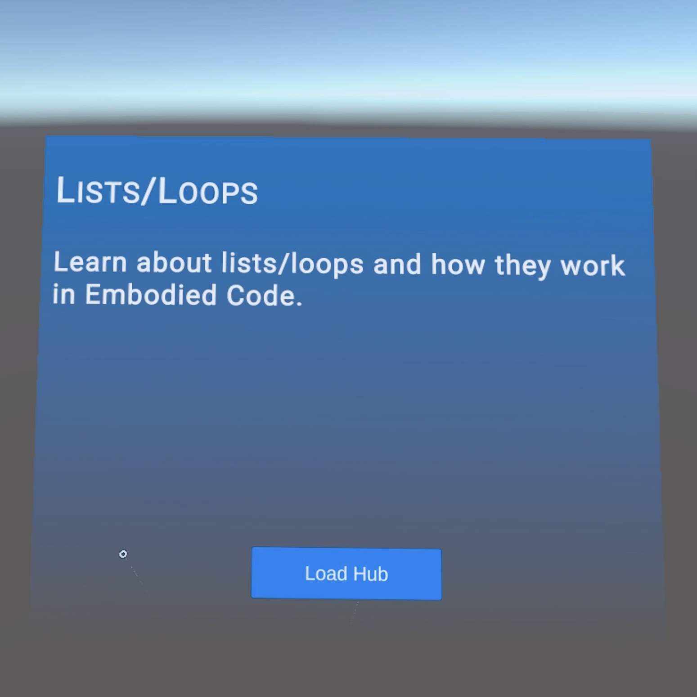
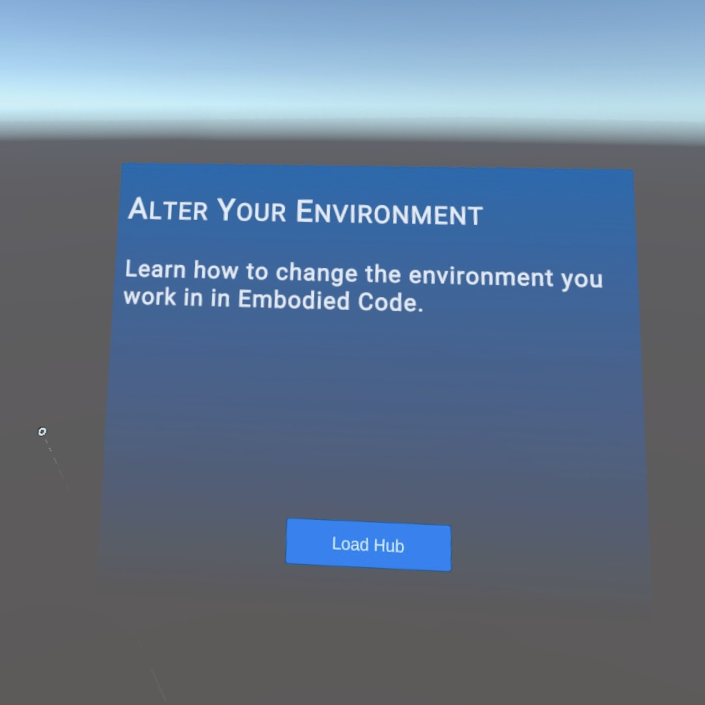
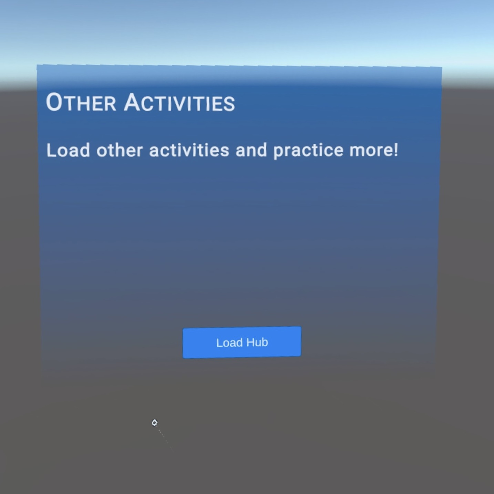

[Overview](README.md) | [Documentation](documentation.md) | [Web Editor](http://app.embodiedcode.net/users/login)

# Tutorials and Activities

There are many premade examples and tutorials within the Embodied Code platform. These are made by developers and other users, available for anyone to use and experience. Tutorials range from a basic introduction to complex coding. 

## Tutorial Hub

Search for "rsc_main_hub" in the load scenes tab of the main menu. This pulls up a hub where all the tutorials and activities are organized. Do the tutorials in order for a comprehensive learning experience, or skip around to different activities as needed. 

# Getting Started

Learn the basics of the Embodied Code platform featuring an intro tutorial and controller tutorial.

# Object Manipulation

Learn how to manipulate objects in Embodied Code. Featuring tutorials on Set Color, Set Transform, Set Kinematics, Spawn and Destroy, and an Object Manipulation activity. 

# Conditionals

Learn about conditional statements and how they work in Embodied Code. Featuring tutorials a Conditional Statements tutorial and activity. 

# Lists and Loops

Learn about lists and loops and how they work in Embodied Code. Featuring tutorials on Lists, For Each Loops (by item and by index), Spawning and Destroying multiple objects, While Loop, and a Lists and Loops activity. 

# Alter Your Environment

Learn how to change the environment you work in. Featuring tutorials on how to alter the sky, ground, light, and gravity, how to load objects, audio, textures and a skybox. 

# Other Activities

Load other examples and activities like Popcorn, Tower, Gravity Box, Scoreboard and Bowling. 

