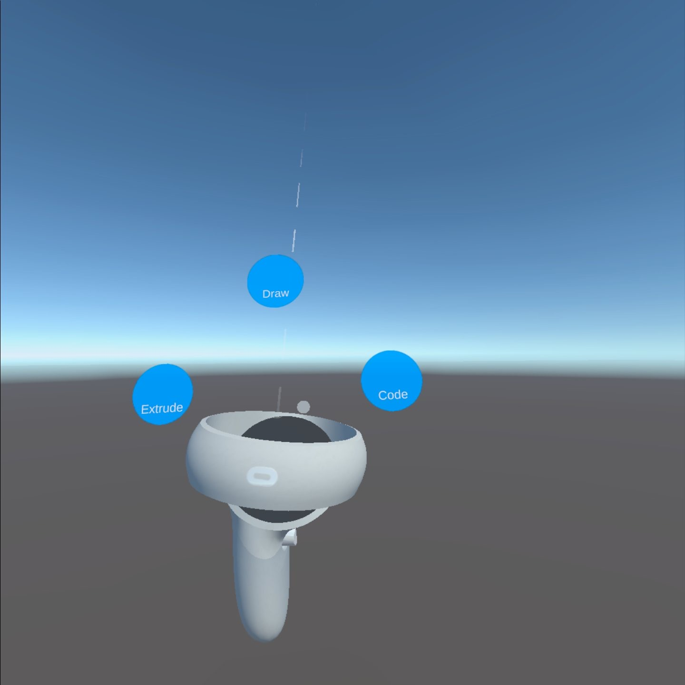
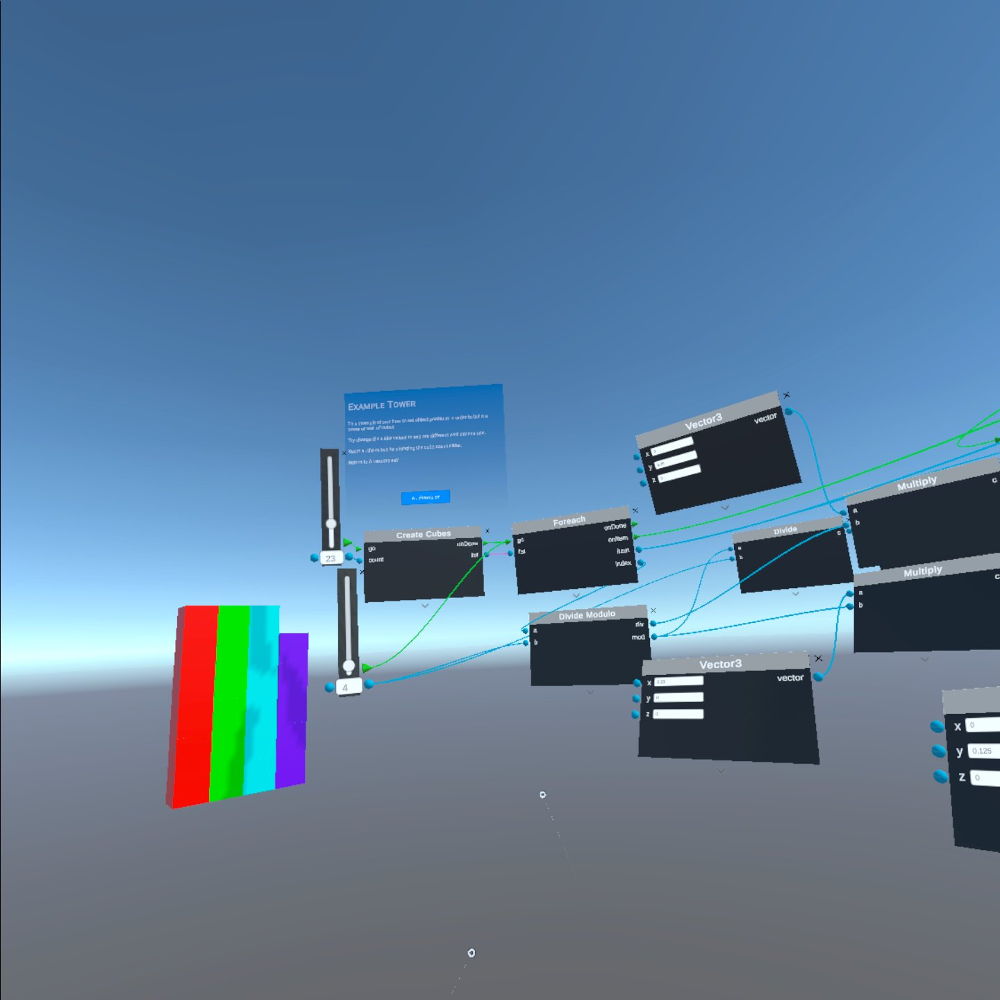

[Overview](README.md) | [Documentation](documentation.md) | [Web Editor](http://app.embodiedcode.net/users/login)

# Embodied Code Documentation

## Getting Started

Follow our [Getting started with Embodied Code on the Quest 2 headset](docs/getting-started.md) tutorial to install the app on our headset and run the first tutorial. 

Ready to try the first tutorial? Follow this introductory tutorial: 

<iframe width="560" height="315" src="https://www.youtube.com/embed/jFYTFTFXay4?si=1CUXyhJNjbfUYkWw" title="YouTube video player" frameborder="0" allow="accelerometer; autoplay; clipboard-write; encrypted-media; gyroscope; picture-in-picture; web-share" referrerpolicy="strict-origin-when-cross-origin" allowfullscreen></iframe>
 

Video by Reid Brockmeier

# Tools

[Learn about all of the tools here](docs/tools.md)

# Tutorials and Activities

 

[Look through the tutorials and activities here](docs/tutorials_activies.md)

