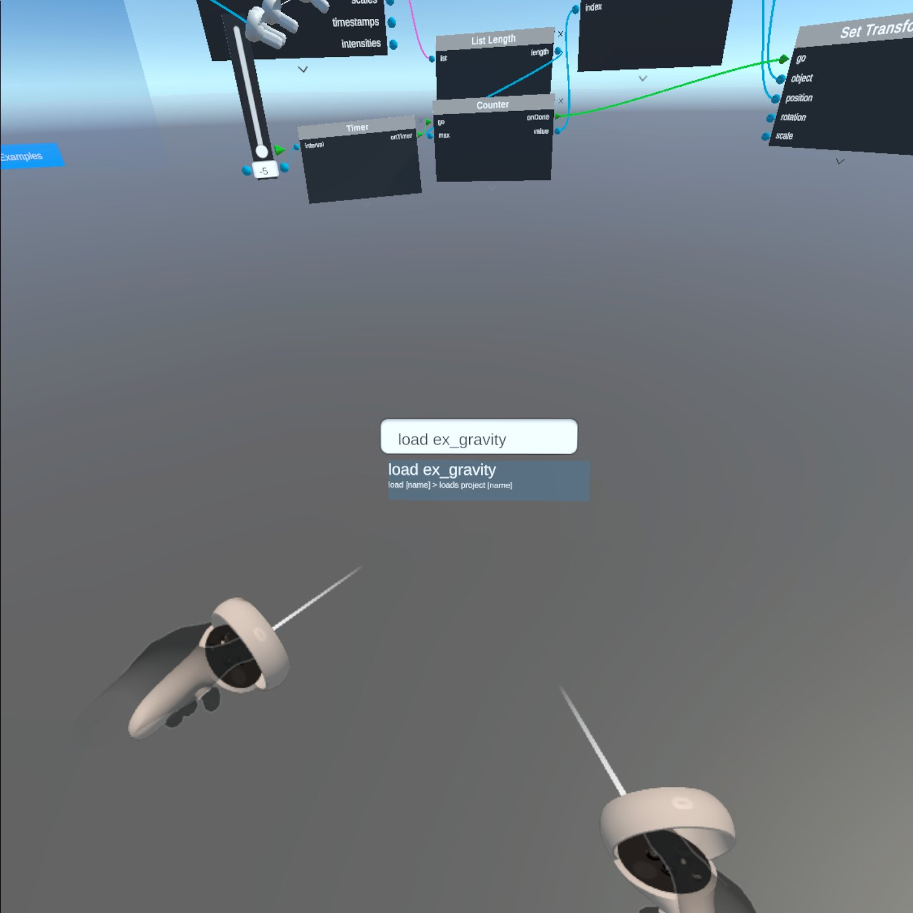

[Overview](README.md) | [Documentation](documentation.md) | [Web Editor](http://app.embodiedcode.net/users/login)

# Embodied Code Documentation

## Getting Started

Follow our [Getting started with Embodied Code on the Quest 2 headset](./getting-started.md) tutorial to install the app on our headset and run the first tutorial. 

Ready to try the first tutorial? Follow this [walk-through video](https://drive.google.com/file/d/10FexZffkHACagAJA0WFbe5Wexv3NoRdY/preview) to familiarize yourself with the basics of Embodied Code. 

# Tools

[Learn about all of the tools here](docs/tools.md)

# Examples

 

[Look through the example scenes and challenges here](./coding-tool.md)

